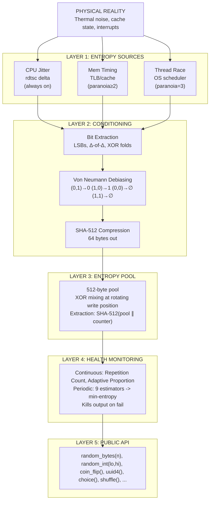
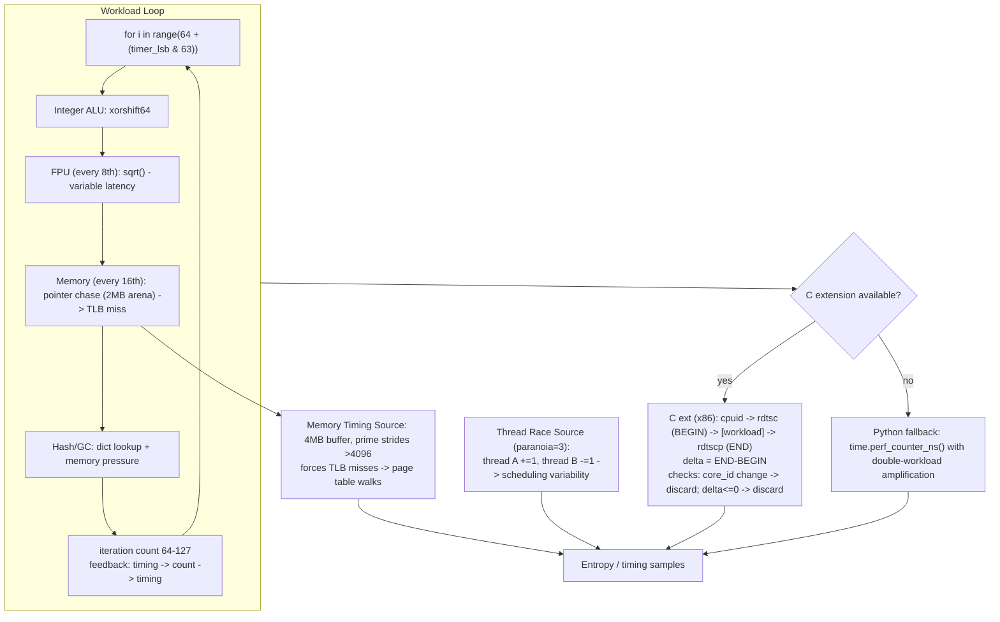

# How VTRNG Works

A complete technical explanation of the entropy pipeline,
from silicon physics to Python API.

## Table of Contents

1. [The Physical Principle](#the-physical-principle)
2. [The 5-Layer Architecture](#the-5-layer-architecture)
3. [Layer 1: Entropy Sources](#layer-1-entropy-sources)
4. [Layer 2: Conditioning](#layer-2-conditioning)
5. [Layer 3: Entropy Pool](#layer-3-entropy-pool)
6. [Layer 4: Health Monitoring](#layer-4-health-monitoring)
7. [Layer 5: Public API](#layer-5-public-api)
8. [Background Collection](#background-collection)
9. [Seed File Persistence](#seed-file-persistence)
10. [Mathematical Foundation](#mathematical-foundation)
11. [Comparison With Other Approaches](#comparison-with-other-approaches)

---

## The Physical Principle

Every CPU instruction takes a slightly different amount of time to
execute. This isn't a bug, it's physics. The variation comes from
phenomena that are fundamentally unpredictable:

### Sources of CPU Timing Jitter

| Phenomenon | Timescale | Physical Cause | 
:----------------------------|:------------------:|:------------------------------------|
| Thermal noise              | Picoseconds      | Brownian motion of electrons in Si |
| Cache hit vs miss          | 1-100 ns         | Data locality in SRAM/DRAM hierarchy |
| Branch misprediction       | 5-20 ns          | Speculative execution pipeline flush |
| TLB miss                   | 10-200 ns        | Page table walk in DRAM            |
| DRAM refresh               | ~64 ms period    | Capacitor charge decay in DRAM cells |
| OS scheduler preemption    | 1-10 ms          | Timer interrupts, other processes  |
| Dynamic frequency scaling  | Milliseconds     | Turbo Boost, thermal throttling    |
| Hardware interrupts        | Microseconds     | Network, disk, USB timer, keyboard |


### Why This Is True Randomness

An attacker trying to predict VTRNG's output would need to know:

1. The thermal state of ~3 billion transistors (impossible to measure)
2. The exact contents of L1/L2/L3 caches (changes every nanosecond)
3. The OS scheduler's queue and interrupt timing (depends on all other processes)
4. The DRAM refresh cycle timing (analog capacitor charge levels)
5. The branch predictor's history table (internal CPU microstate)

This is **more hidden state than the entropy VTRNG extracts**.
Information theory guarantees that the output is unpredictable.

### Prior Art

This approach is proven and deployed:

| Implementation | Deployment | Certification |
|---------------|------------|---------------|
| jitterentropy-rng | Linux kernel (since 5.x) | BSI AIS 31 |
| HAVEGE / haveged | Linux daemon | Academic papers |
| CryptoCell TRNG | ARM TrustZone | Common Criteria |
| VTRNG | pip install vtrng | NIST SP 800-22/90B |

---

## The 5-Layer Architecture




---

## Layer 1: Entropy Sources

### CPU Jitter Source (always active)

The primary entropy source. Runs a deliberately variable workload
and measures execution time at nanosecond (or cycle) precision.

**Workload design:**



```python
for i in range(64 + (timer_lsb & 63)):
#    ├── Integer ALU: xorshift64
#    ├── FPU (every 8th): sqrt() — variable latency
#    ├── Memory (every 16th): pointer chase in 2MB
#    │   arena crossing 4KB page boundaries
#    │   → forces TLB miss → page table walk
#    └── Hash/GC: dict lookup + memory pressure
```

Iteration count varies per call (64-127)
-> feedback loop: timing affects count affects timing

**C extension (x86):**

`cpuid`<- serialize pipeline (flush all in-flight instructions)

`rdtsc` <- read cycle counter (BEGIN timestamp)

`[workload]` <- variable-cost computation

`rdtscp` <- serializing read + core ID (END timestamp)


`delta` = END - BEGIN (cycles, not nanoseconds - higher precision)

if `core_id` changed -> discard sample (core migration detected)

if `delta ≤ 0` -> discard sample (TSC wraparound)


**Python fallback:**

Uses `time.perf_counter_ns()` with double-workload amplification
to compensate for lower timer resolution.

### Memory Timing Source (paranoia ≥ 2)

Walks a 4MB buffer with prime-number strides larger than 4096 bytes.
Every step crosses a 4KB page boundary, forcing TLB misses.

Example stride sequence:
```
Page 0 (0x0000-0x0FFF) ──stride 4099──> Page 1 (0x1003)
──stride 4111──> Page 2 (0x200E)
──stride 4127──> Page 3 (0x302D)
```

TLB misses require the CPU to walk the page table in DRAM,
an operation whose timing depends on DRAM refresh state,
other processes' memory usage, and NUMA topology.

### Thread Race Source (paranoia = 3)

Two OS-level threads race on a shared counter without synchronization:

Thread A: counter += 1 (200 iterations)
Thread B: counter -= 1 (200 iterations)

Expected: counter = 0

Actual: varies based on exact scheduling, cache coherency
protocol timing, and core arbitration

With the C extension, these are native pthreads/Win32 threads
that bypass the Python GIL entirely.

---

## Layer 2: Conditioning

Raw timing samples are biased and correlated. Conditioning
produces uniform, independent output.

### Stage 1: Bit Extraction

Three methods applied in parallel to maximize entropy capture:

- **Method 1** - LSBs of deltas:
   - delta = 10437 -> bits: 1, 0, 1 (lowest 3 bits)

- **Method 2** - Delta of deltas (second derivative):

    - $d[i] - 2·d[i+1] + d[i+2]$
    - Amplifies tiny variations even when deltas look constant.
    - If deltas are [100, 100, 101, 100]:
      - first differences: [0, 1, -1]
      - second differences: [1, -2] <- signal!

- **Method 3** - XOR fold:
   - $d[i] ⊕ d[i+1]$ -> take LSBs
   Combines information from consecutive samples.

### Stage 2: Von Neumann Debiasing

The extracted bits may be biased (more 1s than 0s, or vice versa).
The Von Neumann extractor removes all bias:

Input pairs -> Output:

(0, 1) -> 0

(1, 0) -> 1

(0, 0) -> discard

(1, 1) -> discard

Mathematically proven to produce unbiased output
regardless of input bias level.

Cost: ~75% of input bits discarded.
This is acceptable - we collect many more bits than needed.


**Theorem (Von Neumann, 1951):** If bits $b₁, b₂$ are independent
with $P(bᵢ = 1) = p$ for any $p ∈ (0,1)$, then the debiased output
has $P(output = 0) = P(output = 1) = 0.5$ exactly.

### Stage 3: SHA-512 Compression

Input: debiased bits packed into bytes (variable length)

Output: SHA-512(input) = 64 bytes (fixed length)

SHA-512 is a "vetted conditioning component" per
NIST SP 800-90B §3.1.5.1.1. It concentrates diffuse entropy
into a uniform distribution. Even if the input has only
1 bit of real entropy per byte, the output is computationally
indistinguishable from a perfect random source.

---

## Layer 3: Entropy Pool

A 512-byte (4096-bit) accumulator that mixes entropy from all
sources and extracts random output.

### Mixing (Input)

New entropy is XOR'd into the pool at a rotating write position:

pool: [A][B][C][D][E][F][G][H]...

↑ write_pos

new data: [x][y][z]

result: $[A][B][C⊕x][D⊕y][E⊕z][F][G][H]...$

↑ new write_pos


XOR preserves all existing entropy while incorporating new entropy.

### Extraction (Output)

```python
output = SHA-512(pool_bytes ∥ counter)
counter += 1
pool ⊕= output[:64]    # forward secrecy: mutate pool
```

**Forward secrecy**: After extraction, the pool state is permanently
changed. Even if an attacker obtains the pool contents after
extraction, they cannot recover previous outputs.

### Entropy Accounting

The pool tracks estimated entropy bits in vs out:

```
mix_in(data, estimated_bits=32)  → entropy_in += 32
extract(64 bytes)                → entropy_out += 512

If entropy_out > entropy_in → depends on policy:
  WARN:      log warning, continue
  BLOCK:     wait for background collector
  RAISE:     throw InsufficientEntropyError
  UNLIMITED: ignore (for non-security uses)

```

## Layer 4: Health Monitoring
### Continuous Tests (every sample)
**Repetition Count Test (RCT) - NIST SP 800-90B §4.4.1:**

Fires if any value repeats C consecutive times, where
$C = 1 + ⌈-log₂(α) / H⌉$ with $α = 2⁻²⁰$.

If $H = 1.0$ bit/sample: $C = 21$. Twenty-one identical values
in a row -> source is broken -> output halted.

**Adaptive Proportion Test (APT) - NIST SP 800-90B §4.4.2:**

In a sliding window of 512 samples, if any single value
appears more than a threshold number of times -> source is
biased -> output halted.


### Periodic Assessment (9 estimators)

|#| Estimator | What it Measures |
|--|---|---|
| §6.3.1 | Most Common Value | Is one value too frequent? |
| §6.3.2 | Collision | How quickly do values repeat? |
| §6.3.3 | Markov | Is there a pattern in bit transitions? |
| §6.3.4 | Compression | How compressible is the output? |
| §6.3.5 | t-Tuple | Are any short patterns overrepresented? |
| §6.3.7 | MultiMCW | Can the mode of a window predict the next value? |
| §6.3.8 | Lag | Does value[i] predict value[i+d]? |
| §6.3.9 | MultiMMC | Can a Markov chain predict the next value? |
| §6.3.10 | LZ78Y | Can a dictionary compressor predict the next value? |

**Final min-entropy = min(all estimates)**

This is maximally conservative. If ANY estimator finds a weakness,
the assessment reports it.

## Layer 5: Public API

All randomness extraction goes through the API layer, which adds:
- **Rejection sampling** for random_int() - eliminates modulo bias
- **53-bit precision** for random_float() - fills IEEE 754 mantissa
- **Fisher-Yates** for shuffle() - uniform permutation
- **Health checks** before output - refuses if source is degraded

---

## Background Collection
A daemon thread continuously harvests entropy:

```
Background Thread (daemon)

while running:
   samples = jitter.sample(256)
   conditioned = condition(samples)
   pool.mix_in(conditioned)
   sleep(1.0 second)

Failure handling:
   10 consecutive failures -> STOP
   Generator checks collector.healthy
   Raises HealthCheckError if dead

```

This means fresh entropy is always available when you call
`random_bytes()`, no collection delay

---

## Seed File Persistence

On shutdown, VTRNG saves SHA-512(pool_state) to `~/.vtrng_seed`.
On next startup, this seed is XOR'd into the pool before collection.

```
Session 1:              Session 2:
  collect entropy         load seed from session 1
  generate output    ->   XOR into pool
  save seed file          collect fresh entropy
                          output combines BOTH
```

This defends against the "cold boot" scenario where the CPU's
initial state might be too predictable (empty caches, reset
branch predictor).

The seed file is **supplementary**, VTRNG works without it.
It's a defense-in-depth measure.

## Mathematical Foundation
### Shannon Entropy

For a discrete random variable X with possible values x₁...xₙ:

```math
H(X) = -Σ P(xᵢ) · log₂(P(xᵢ))
```

Maximum entropy occurs when all values are equally likely.

For 256 possible byte values: $H_max = log₂(256) = 8 bits/byte$.

### Min-Entropy
More conservative than Shannon entropy:

```math
H_min(X) = -log₂(max_i P(xᵢ))
```

Min-entropy represents the "worst case" - how predictable is
the single most likely outcome? NIST SP 800-90B uses min-entropy
because it provides a security bound.

## Why SHA-512 Conditioning Works

If the input has H_real bits of min-entropy and the output is
n bits, then as long as H_real > n + 2·security_level, the
output is computationally indistinguishable from uniform random.

For SHA-512 with 64 bytes output (512 bits) and 128-bit security:
we need H_real > 512 + 256 = 768 bits of input entropy.

With ~1 bit per sample and 512 samples per collection: 512 bits.
Multiple rounds of collection easily exceed this.


---


## Comparison With Other Approaches

| Approach | Type | Entropy Source | Auditability | Availability |
|----------|------|----------------|-------------|--------------|
|`random` (Python) | PRNG | Deterministic seed | High | Everywhere |
| `os.urandom()` | CSPRNG | OS kernel pool | Low (kernel code) | Everywhere |
| `secrets` | CSPRNG | OS kernel pool | Low | Python 3.6+ |
| Intel RDRAND | HRNG | On-die noise circuit | None (black box) | Intel CPUs |
| Hardware RNG dongle | HRNG | Physical noise circuit | Varies | Requires hardware |
| Lava lamp camera | TRNG | Fluid dynamics | High | Cloudflare only |
| **VTRNG** | **TRNG** | **CPU jitter physics** | **Very high** | **pip install** |

---
